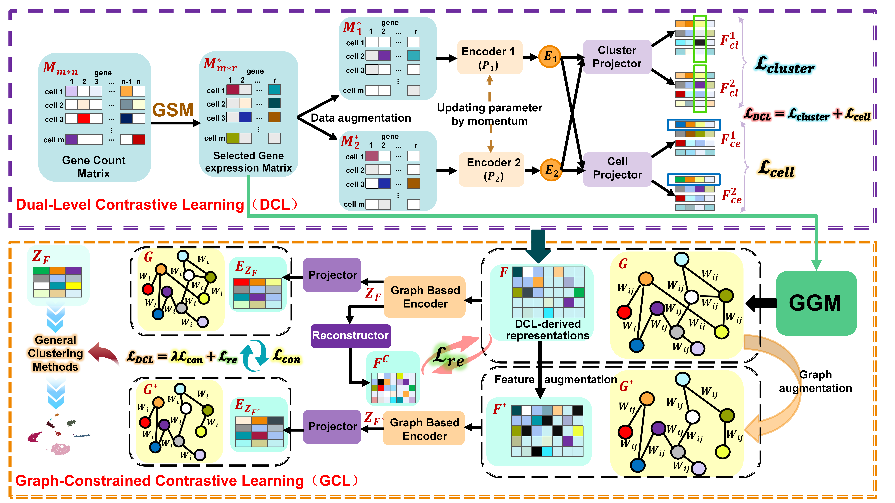

# scDGCL: A Dual-level and Graph-constrained Contrastive Learning Method for Single-cell RNA Sequencing Data Clustering

## Requirements
- python : 3.8.19
- scanpy : 1.8.2
- sklearn : 1.3.2
- torch : 2.0.1
- torch-geometric : 2.5.3


## Usage  
First, the Original_data directory contains raw data for 10 real datasets, including extensive information from the sequencing process. We extract key information, such as the cell-gene count matrix and labels, using the preprocessH5.py script in the same directory:
```bash
cd Original_data
python preprocessH5.py
```
The initially extracted data is located in the H5_data directory, which is at the same level as the Original_data directory.
To use GSM for data processing, switch to the GSM directory and run the following code:
```bash
cd GSM
python Gene_Selection.py
```
After running the script, we obtain the subset of gene expression data selected from the files in the H5_data directory and save it in CSV format. Then, run the trans_csv_to_h5.py script in the GSM directory to convert the CSV data to .h5 format, attaching labels corresponding to each cell:
```bash
cd GSM
python trans_csv_to_h5.py
```
In this way, we obtain fully preprocessed data stored in .h5 file format in the Selected_data directory.

Once the data is processed, we can execute the scDGCL method for clustering using the following command:
```bash
cd scDGCL
python main.py
```
If you find the data preprocessing process cumbersome, we also provide all the processed data. You can skip the initial processing and directly execute the following command to use scDGCL:
```bash
cd scDGCL
python main.py
```
